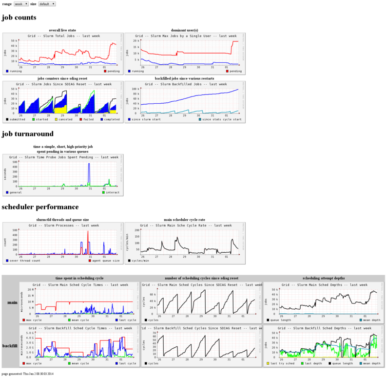

Slurmmon is a system for gaining insight into [Slurm](http://www.schedmd.com/) and the jobs it runs.
It's meant for cluster administrators looking to raise cluster utilization and measure the effects of configuration changes.
Features include:

* trending all the scheduler performance diagnostics (`sdiag` output)
* measuring job turnaround time of *probe jobs*, as a bellwether of scheduling issues
* creating daily *whitespace* reports -- identifying specific users and jobs with low utilization of their allocations (the jobs that lead to the dreaded whitespace gap in plots of total resources vs. used resources)

Slurmmon is meant to run on a RHEL/CentOS/SL 6 based system and currently uses Ganglia for data collection and Apache/mod_python for reporting.
The components are:

* [slurmmon-daemon](RPMS/slurmmon-daemon-0.0.2-fasrc03.noarch.rpm?raw=true) -- the daemons that query Slurm and send data to Ganglia
* [slurmmon-ganglia](RPMS/slurmmon-ganglia-0.0.2-fasrc03.noarch.rpm?raw=true) -- the Ganglia custom reports that use php to stack raw rrd data
* [slurmmon-web](RPMS/slurmmon-web-0.0.2-fasrc03.noarch.rpm?raw=true) -- a set of web pages that organize all the reports and relevant plots
* [slurmmon-python](RPMS/slurmmon-python-0.0.2-fasrc03.noarch.rpm?raw=true) -- a general python interface to Slurm, using lazy evaluation

See the `doc` directory for more information, specifically:

* [INSTALL](doc/INSTALL.md) for initial installation and setup
* [FAQ](doc/FAQ.md) for answers to common questions and other details

Here is a screenshot of the basic diagnostic report from the production cluster at FASRC:

