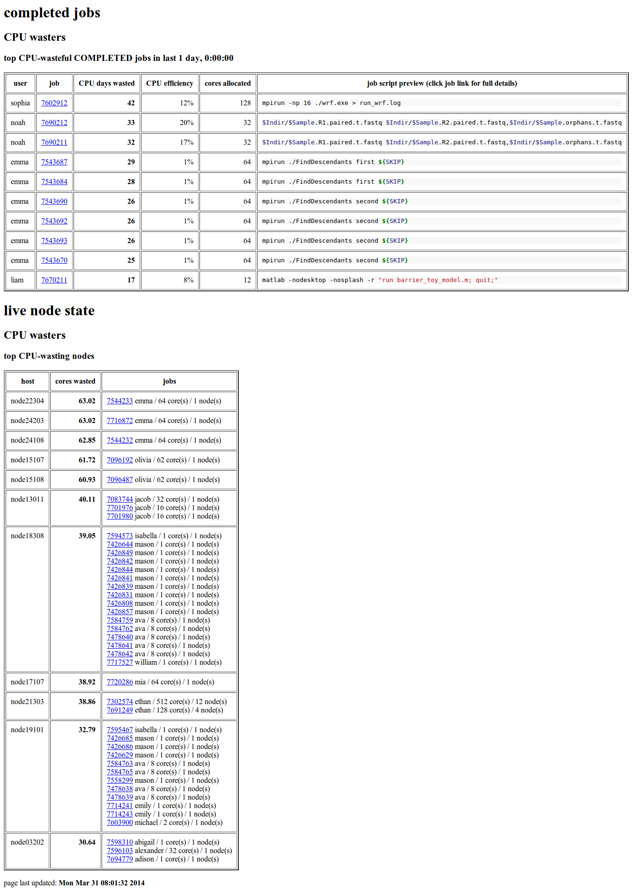
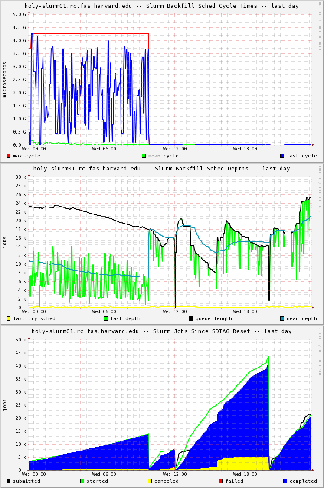

Slurmmon is a system for gaining insight into [Slurm](http://www.schedmd.com/) and the jobs it runs.
It's meant for cluster administrators looking to measure the effects of configuration changes and raise cluster utilization.
Features include:

* trending all the scheduler performance diagnostics (the numbers from `sdiag`)
* measuring job turnaround time of *probe jobs*, as a bellwether of scheduling issues
* creating daily *whitespace* reports -- identifying specific users and jobs with low utilization of their allocations (the jobs that lead to the dreaded whitespace gap in plots of total resources vs. used resources)

Slurmmon is meant to run on a RHEL/CentOS/SL 6 based system and currently uses Ganglia for data collection and Apache/mod_python for reporting.
The components are:

* [slurmmon-daemon](RPMS/slurmmon-daemon-0.0.2-fasrc04.noarch.rpm?raw=true) -- the daemons that query Slurm and send data to Ganglia
* [slurmmon-ganglia](RPMS/slurmmon-ganglia-0.0.2-fasrc04.noarch.rpm?raw=true) -- the Ganglia custom reports that use php to stack raw rrd data
* [slurmmon-web](RPMS/slurmmon-web-0.0.2-fasrc04.noarch.rpm?raw=true) -- a set of web pages that organize all the reports and relevant plots
* [slurmmon-python](RPMS/slurmmon-python-0.0.2-fasrc04.noarch.rpm?raw=true) -- a general python interface to Slurm, using dict-based io pipelines and lazy evaluation (but being replaced by [dio](https://github.com/jabrcx/dio) and [slyme](https://github.com/fasrc/slyme))

See the `doc` directory for more information, specifically:

* [INSTALL](doc/INSTALL.md) for initial installation and setup
* [FAQ](doc/FAQ.md) for answers to common questions and other details

---

Here is a screenshot of the basic diagnostic report from the production cluster at @fasrc:

It shows how something interesting happened on the 31st -- there was a spike in *job turnaround* and *slurmctld agent queue size*.

---

Here is an example daily whitespace (CPU waste) report:

Of the jobs that completed in that day, the top CPU-waster was *sophia*'s, and it was a case of mismatched Slurm `-n` (128) and mpirun `-np` (16) (the latter is unnecessary -- user education opportunity).
Lots of other jobs show the issue of asking for many CPU cores but using only one.
The job IDs are links to full details.

---

Here is a stack of plots from our Slurm upgrade from 2.6.9 to 14.03.4 around 10:00 a.m.:

It shows the much faster backfill scheduler runs (top plot), deeper backfill scheduler runs (middle plot), and higher job throughput (slope of completed jobs in bottom plot).
